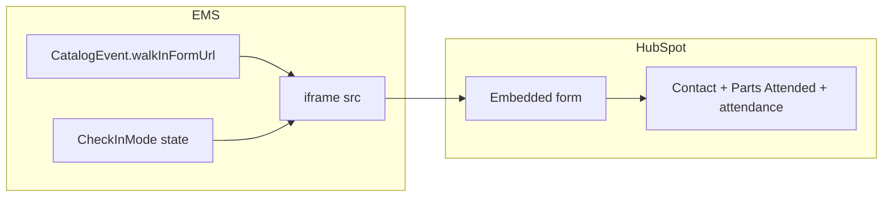
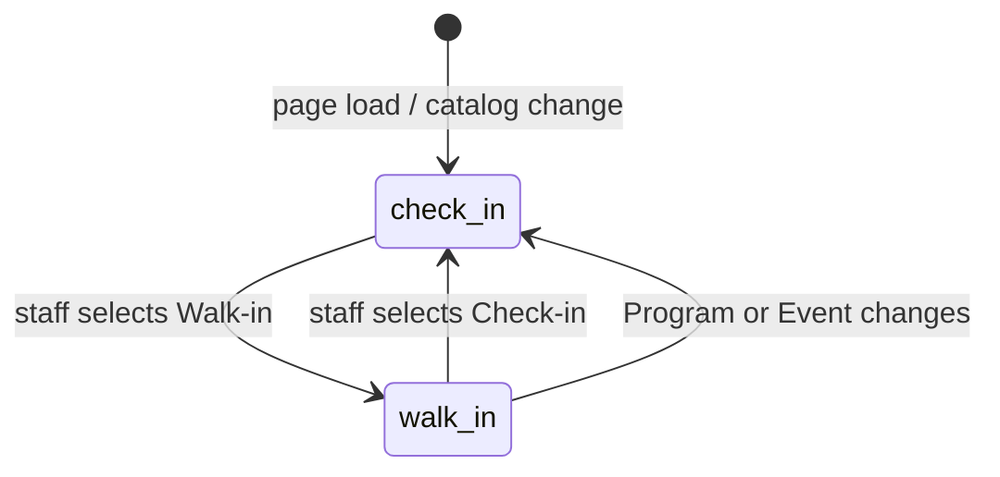

# Data Model: US3 Walk-in (003-check-in)

**Tranche**: User Story 3 only  
**Date**: 2026-07-06  
**Prerequisites**: [001-catalog-admin](../001-catalog-admin/spec.md), [002-catalog-metadata-modal](../002-catalog-metadata-modal/spec.md), US1 + US2 shipped

---

## Overview

US3 adds one optional catalog field and one view-local UI state. **No new HubSpot write entities in EMS.** Walk-in attendance is recorded entirely inside HubSpot via the embedded form.

---

## Catalog: Event extension

### `walkInFormUrl` (optional)

| Attribute | Value |
| :--- | :--- |
| **Storage** | `CatalogEventRecord` in Record Storage (same store as 001/002 metadata) |
| **Type** | `string \| undefined` (omitted when unset) |
| **Semantics** | HTTPS URL of HubSpot form embed page or share link for on-site walk-in intake for this Event |
| **Required** | No |
| **Editable via** | `POST catalog/event`, `PATCH catalog/event/{id}` (Event modal) |
| **Clear** | PATCH `{ "walkInFormUrl": null }` or empty string after trim |
| **Exposed on** | `GET catalog` tree — each Event node may include `walkInFormUrl` |

### Validation rules

| Rule | Enforcement |
| :--- | :--- |
| Scheme must be `https:` | Frontend modal + backend catalog handlers |
| Host allowlist: `*.hubspot.com`, `*.hsforms.com`, `share.hsforms.com` | Frontend modal + backend catalog handlers |
| Max length | Reuse existing catalog text metadata max (same as `description` / `owner`) |
| Invalid on save | Field error (frontend); `400 validation_error` (backend) |
| Invalid in stored record (legacy) | Check-in Walk-in mode shows validation error; **do not** set iframe `src` |

### TypeScript surfaces (to implement)

| Location | Type |
| :--- | :--- |
| `Frontend/src/types.ts` | `CatalogEvent`, `CatalogEventRecord`, `CreateCatalogEventBody`, `PatchCatalogEventBody` |
| `Backend/scripts/Utils/Types.ts` | Mirror catalog Event types |
| `Frontend/src/state/catalogContext.tsx` | `CatalogSelection.walkInFormUrl?: string \| null` |

---

## View state: Check-in mode

### `CheckInMode`

| Value | UI |
| :--- | :--- |
| `'check-in'` (default) | US2 layout: search table + QR scanner + confirm card |
| `'walk-in'` | Staff hint + HubSpot iframe only; table and QR unmounted |

| Attribute | Value |
| :--- | :--- |
| **Persistence** | React `useState` in `CheckInView` — **not** URL hash, **not** localStorage |
| **Reset** | On Program/Event change → reset to `'check-in'` |
| **Visibility** | Mode switch rendered only when `programId` + `evId` set and `session.role === 'admin'` |

### State transitions

**Side effects on `walk_in` → `check_in`**:
- Remove iframe from DOM (no background HubSpot load).
- QR scanner may start again when `CheckInQrPanel` remounts (existing US2 lifecycle).

**Side effects on `check_in` → `walk_in`**:
- Unmount `CheckInQrPanel` → stop camera (same as US2 navigate-away rules).

---

## Entities unchanged

| Entity | US3 role |
| :--- | :--- |
| `SliceAttendee` | Staff verify walk-in registrant appears after manual Attendees refresh (read-only) |
| HubSpot Contact / Parts Attended | Mutated by HubSpot form only — EMS read path unchanged (US1) |
| Check-in JWT / scan / confirm | Unchanged — Walk-in mode does not use these routes |

---

## Out of scope (explicit)

| Removed from prior draft | Reason |
| :--- | :--- |
| `WalkInSubmitBody` | No EMS walk-in POST |
| `OnWalkIn` handler | FR-015 |
| `submitWalkIn` dataService method | No EMS API |
| EMS audit row for walk-in submit | NFR-002 — not an EMS mutation |

---

## Contract sync targets

When implementing, update in the **same change**:

- `Frontend/docs/api-contract.md` — `POST/PATCH catalog/event` optional `walkInFormUrl`; remove provisional `POST …/walkin`
- `specs/003-check-in/contracts/catalog-event-walkin.md` (this tranche)
- `specs/003-check-in/contracts/check-in-api.md` — mark walk-in route out of scope
