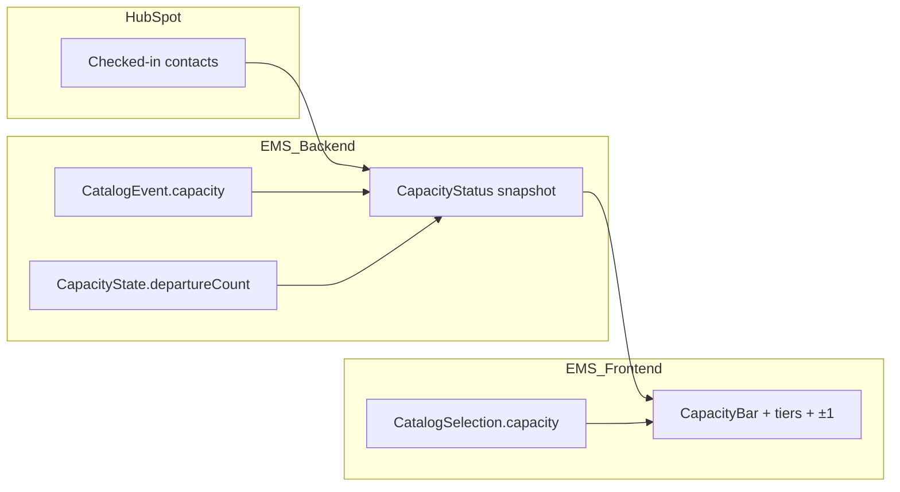
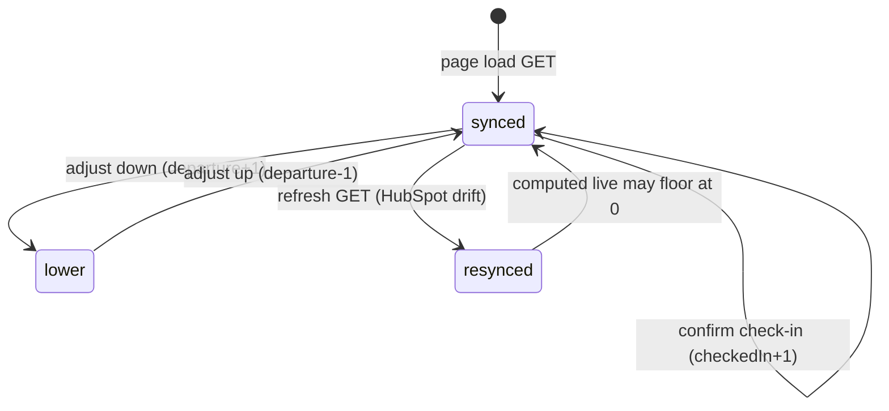

# Data Model: Capacity Management (004)

**Feature**: Slice 1  
**Date**: 2026-07-07  
**Prerequisites**: [003-check-in](../003-check-in/spec.md), [001-catalog-admin](../001-catalog-admin/spec.md) Event `capacity` metadata

---

## Overview

Slice 1 adds **operational capacity state** (anonymous departure counter) and **Check-in UI** for live attendance. Catalog Event `capacity` is read-only in this slice. No HubSpot schema changes.



---

## Catalog (read-only consumption)

### `CatalogEvent.capacity`

| Attribute | Value |
| :--- | :--- |
| **Storage** | `CatalogEventRecord` (existing 001/002) |
| **Type** | `number \| undefined` |
| **Semantics** | Venue upper bound for occupancy percentage |
| **Edited via** | Event catalog modal only — **not** Check-in ±1 controls |
| **Check-in use** | Denominator for `occupancyPct`; if unset/zero/non-finite → count-only UI (FR-006) |

### `CatalogSelection.capacity` (frontend)

| Attribute | Value |
| :--- | :--- |
| **Type** | `number \| undefined` |
| **Source** | Selected Event from `GET catalog` via `CatalogPickers` |
| **Persistence** | React context only |

---

## Operational: CapacityState

### Record Storage document

| Attribute | Value |
| :--- | :--- |
| **Key** | `ems-capacity-{programId}--{eventId}` |
| **Scope** | Workspace Record Storage |
| **Value shape** | `{ departureCount: number }` |
| **departureCount** | Non-negative integer; default **0** when key missing |
| **Mutations** | POST adjust only (`direction: down` → +1 to departureCount; `direction: up` → −1, min 0) |

### Invariants

| Rule | Enforcement |
| :--- | :--- |
| `departureCount >= 0` | Store clamp on write |
| `liveAttendance = max(0, checkedInCount - departureCount)` | Computed on GET and after adjust |
| `liveAttendance <= checkedInCount` | When equality holds, reject `direction: up` (422) |
| `liveAttendance >= 0` | When 0, reject `direction: down` (422) |
| Adjust does not change `checkedInCount` | No HubSpot adapter call on POST adjust |

---

## API snapshot: CapacityStatus

Returned by GET and POST adjust (updated snapshot).

| Field | Type | Description |
| :--- | :--- | :--- |
| `programId` | string | Catalog Program id |
| `eventId` | string | Catalog Event id |
| `capacity` | number \| null | From catalog; null if unset |
| `checkedInCount` | number | HubSpot-backed total checked-in |
| `departureCount` | number | Persisted anonymous departures |
| `liveAttendance` | number | Computed live on-site count |

Frontend derives **tier** and **display percent** locally (`capacityTier.ts`) — not stored server-side.

---

## View tier (frontend-only)

### `CapacityTier`

| Value | When (`capacity > 0`) |
| :--- | :--- |
| `normal` | `occupancyPct < 75` |
| `caution` | `75 <= occupancyPct < 90` |
| `critical` | `90 <= occupancyPct <= 100` |
| `over` | `occupancyPct > 100` (live exceeds venue capacity) |

`occupancyPct = round((liveAttendance / capacity) * 100)` (display); bar fill `min(100, occupancyPct)`.

---

## Adjust request

### POST body

```typescript
interface AdjustCapacityBody {
  direction: 'up' | 'down';
}
```

| direction | Staff action | departureCount delta |
| :--- | :--- | :--- |
| `down` | Person left (−1 live) | +1 |
| `up` | Correction (+1 live) | −1 (min 0) |

---

## Audit entry (mutation)

| Field | Value |
| :--- | :--- |
| `action` | `capacity.adjust` |
| `resourceType` | `catalog_event` |
| `resourceId` | `eventId` |
| `metadata` | `{ programId, direction, departureCountBefore, departureCountAfter }` |

No PII.

---

## Entities unchanged

- HubSpot Contact / attendance properties (003)
- Attendee list rows
- Check-in confirm / scan payloads
- Event `capacity` catalog write path (001/002)

---

## State transitions (live attendance)



**Catalog change** (Program/Event switch): load new Event’s CapacityState key and capacity metadata — no carry-over.
