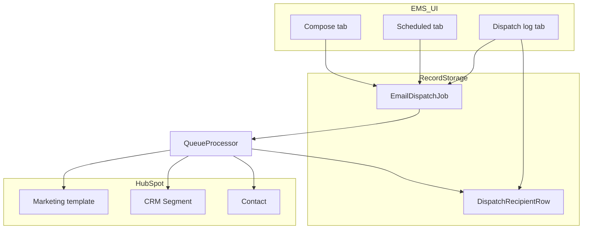
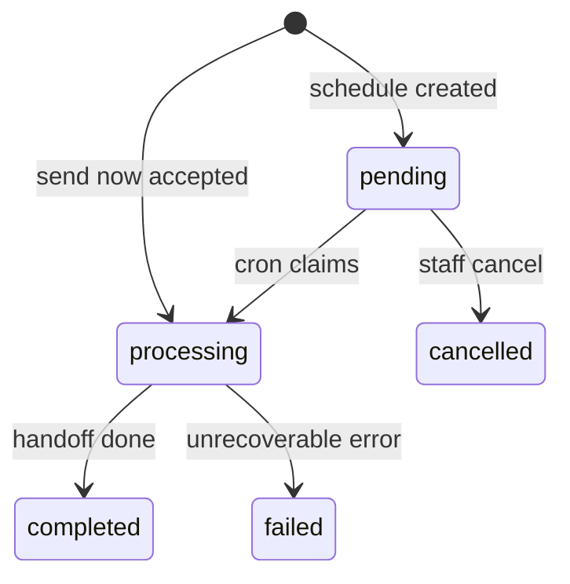

# Data Model: Email Dispatch (Slice 2)

**Feature**: 005-email-dispatch  
**Date**: 2026-07-07  
**Prerequisites**: [003-check-in](../003-check-in/spec.md) (attendees, catalog context), [spec.md](./spec.md)

---

## Overview

Slice 2 introduces **Email dispatch jobs** (EMS-owned, Record Storage) that reference **HubSpot marketing templates** and either **Registered attendee audiences** or **HubSpot CRM segments**. Processing runs in a **background queue**; outcomes are stored as **per-Contact sent rows** for dispatch log and attendee filtering.

---

## Entity: EmailDispatchJob

One staff-initiated send (immediate or scheduled).

| Field | Type | Notes |
| :--- | :--- | :--- |
| `dispatchId` | string | System-generated UUID (FR-003) |
| `dispatchName` | string | Staff-entered label (no format rules) |
| `programId` | string | Catalog Program |
| `eventId` | string | Catalog Event (`evId`) |
| `templateId` | string | HubSpot marketing email id |
| `templateName` | string | Snapshot at create time for log |
| `audience` | `DispatchAudience` | See below |
| `status` | `DispatchStatus` | See lifecycle |
| `scheduledAtUtc` | string \| null | ISO instant; `null` = send now |
| `timezone` | string \| null | IANA; required when scheduled |
| `createdBy` | string | Admin email |
| `createdAt` | string | ISO |
| `updatedAt` | string | ISO |
| `startedAt` | string \| null | When processing began |
| `completedAt` | string \| null | When terminal state reached |
| `recipientCountPlanned` | number | From preview at accept time |
| `recipientCountSent` | number | Contacts with **sent** outcome |
| `idempotencyKey` | string | Client UUID for dedupe |

### DispatchStatus

| Value | Meaning | UI surface |
| :--- | :--- | :--- |
| `pending` | Scheduled, not yet claimed by cron | Scheduled tab; editable |
| `processing` | Cron claimed; HubSpot handoff in progress | Scheduled tab (locked) or Log (in progress) |
| `completed` | Processing finished (possibly partial sent) | Dispatch log |
| `failed` | Job-level failure (e.g. template missing) | Dispatch log |
| `cancelled` | Staff cancelled while `pending` | Removed from Scheduled |

**Lock rule**: PATCH/DELETE allowed only in **`pending`**. **`processing`** → edit/cancel blocked (FR-008).

**Warning rule**: `pending` job shows lock warning when `scheduledAtUtc - now ≤ 15 minutes` (FR-009).

---

## Value object: DispatchAudience

| `type` | Fields | Resolution |
| :--- | :--- | :--- |
| `registered_all` | — | All Registered attendees |
| `registered_checked_in` | — | Registered + checked in |
| `registered_not_checked_in` | — | Registered + not checked in |
| `registered_manual` | `contactIds: string[]` | Fixed list (Clarification: fixed selection) |
| `hubspot_segment` | `segmentId`, `segmentName`, `segmentKind: "active" \| "static"` | HubSpot membership at processing time |

**Audience summary string** (for lists/log): human-readable, e.g. `"All registered (142)"`, `"Segment: VIP Prospects (Active)"`.

---

## Entity: DispatchRecipientRow

Per-Contact outcome for one dispatch (FR-012).

| Field | Type | Notes |
| :--- | :--- | :--- |
| `dispatchId` | string | FK to job |
| `contactId` | string | HubSpot Contact id |
| `email` | string | Allowlisted for log display |
| `outcome` | `"sent"` | Slice 2 only; no bounce/delivery |
| `sentAt` | string | ISO when handoff succeeded |

Contacts without successful handoff **omit** a row (partial completion).

---

## Entity: DispatchLimits (derived, not stored)

Returned by `GET …/email/limits` for Compose tab.

| Field | Type | Source |
| :--- | :--- | :--- |
| `dispatchLimitPerHour` | number | Parameter `DISPATCH_RATE_LIMIT_PER_HOUR` |
| `dispatchUsedThisHour` | number | Count of creates by session email in rolling hour |
| `largeSendThreshold` | number | Parameter / config mirror of `EMAIL_SEND_CONFIRM_THRESHOLD` |

---

## HubSpot read models (DTO only)

### MarketingTemplateOption

| Field | Notes |
| :--- | :--- |
| `id` | HubSpot template id — not shown in routine UI |
| `name` | Picker label |
| `description?` | Optional subtitle |

### HubSpotSegmentOption

| Field | Notes |
| :--- | :--- |
| `id` | HubSpot list/segment id |
| `name` | Picker label |
| `kind` | `"active"` \| `"static"` |

---

## Attendee list extension

Existing `GET …/attendees` query params:

| Param | Values | Behaviour |
| :--- | :--- | :--- |
| `dispatchId` | string | Required with filter below |
| `dispatchFilter` | `received` \| `not_received` | Subset of **Registered attendees** for Event |

Ignored for non-admin; invalid dispatch id → `404`.

---

## Audit events

| Action | When | Metadata |
| :--- | :--- | :--- |
| `email.dispatch.create` | Job accepted | `dispatchId`, `recipientCountPlanned`, `scheduled` boolean |
| `email.dispatch.update` | Pending job edited | changed fields |
| `email.dispatch.cancel` | Pending cancelled | `dispatchId` |
| `email.dispatch.complete` | Job terminal | `recipientCountSent` |

---

## Out of scope (explicit)

| Item | Reason |
| :--- | :--- |
| Template content storage | HubSpot-only (FR-014) |
| Bounce/open/click rows | Spec out of scope |
| `communications` role | Admin-only Slice 2 |
| Public registration entities | Slice 3 |
