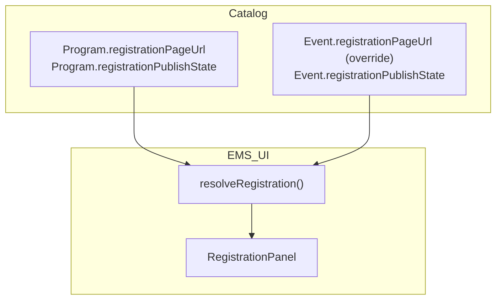
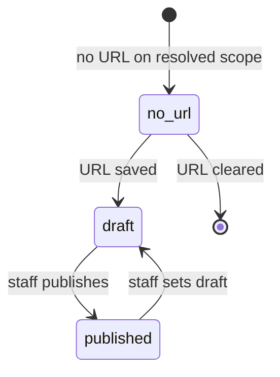

# Data Model: Public Registration (Slice 3)

> **Historical data-model draft — re-plan before implementing.** Assumes Plan C catalog selection and a Settings-hosted Registration panel. Revalidate field homes against the shipped HubSpot custom-object catalog ([docs/hubspot-schema.md](../../docs/hubspot-schema.md)) and resolve registration from the working Event / catalog APIs, not deleted pickers.

**Feature**: 006-public-registration  
**Date**: 2026-07-07  
**Prerequisites**: [001-catalog-admin](../_shipped/001-catalog-admin/spec.md), [002-catalog-metadata-modal](../_shipped/002-catalog-metadata-modal/spec.md), [003-check-in](../003-check-in/spec.md) (walk-in URL — unchanged)

---

## Overview

Slice 3 adds **two optional catalog metadata fields** on Program and Event. **No new HubSpot properties.** Staff-facing **resolved registration** was planned as Frontend computation from catalog selection + Program/Event nodes *(re-plan: resolve from working Event / `GET catalog`)*.

---

## Catalog: Program extension

### `registrationPageUrl` (optional)

| Attribute | Value |
| :--- | :--- |
| **Storage** | `CatalogProgramRecord` metadata |
| **Type** | `string \| undefined` |
| **Semantics** | Default **public** HubSpot landing page URL for Contacts signing up under this Program |
| **Required** | No |
| **Editable via** | `POST catalog/program`, `PATCH catalog/program/{id}`, Registration panel (when Event has no override) |
| **Clear** | PATCH `{ "registrationPageUrl": null }` or empty after trim |

### `registrationPublishState` (optional)

| Attribute | Value |
| :--- | :--- |
| **Storage** | `CatalogProgramRecord` metadata |
| **Type** | `'draft' \| 'published' \| undefined` |
| **Semantics** | EMS operational intent — whether staff may copy/share Program default link |
| **Default** | `draft` when URL first saved without explicit state (clarify Q5) |
| **Editable via** | Same as `registrationPageUrl` |

---

## Catalog: Event extension (override)

### `registrationPageUrl` (optional override)

| Attribute | Value |
| :--- | :--- |
| **Storage** | `CatalogEventRecord` metadata |
| **Type** | `string \| undefined` |
| **Semantics** | When set, **overrides** Program URL for this Event only |
| **Required** | No |
| **Editable via** | `POST catalog/event`, `PATCH catalog/event/{id}`, Registration panel (when override active or being set) |
| **Clear** | PATCH `null` → resolution falls back to Program URL + Program publish state |

### `registrationPublishState` (optional, override scope)

| Attribute | Value |
| :--- | :--- |
| **Storage** | `CatalogEventRecord` metadata |
| **Type** | `'draft' \| 'published' \| undefined` |
| **Semantics** | Independent publish state **only when** Event `registrationPageUrl` is set |
| **Default** | `draft` when override URL first saved without explicit state |
| **Ignored when** | Event override URL cleared — Program publish state applies |

---

## Validation rules

| Rule | `registrationPageUrl` | `registrationPublishState` |
| :--- | :--- | :--- |
| Scheme HTTPS | Required | N/A |
| Host | `*.hubspot.com`, `*.hs-sites.com`, or any valid HTTPS host | N/A |
| Enum | N/A | `draft` or `published` only |
| Max length | Reuse catalog text metadata max | N/A |
| Invalid on save | Field error / `422 validation_error` | Field error / `422 validation_error` |
| First URL save | Allowed with implicit `draft` state | Defaults to `draft` |

**Not validated against**: HubSpot live publish status, Event catalog `status`, walk-in `walkInFormUrl`.

---

## Resolved registration (computed — not stored)

| Field | Rule |
| :--- | :--- |
| `resolvedUrl` | `event.registrationPageUrl` if set, else `program.registrationPageUrl` |
| `resolvedPublishState` | If Event override URL set → `event.registrationPublishState ?? 'draft'`; else `program.registrationPublishState ?? 'draft'` |
| `source` | `'event'` if Event override URL set; else `'program'` |
| `copyEnabled` | `resolvedUrl` set **and** `resolvedPublishState === 'published'` |

---

## TypeScript surfaces (to implement)

| Location | Types / fields |
| :--- | :--- |
| `Frontend/src/types.ts` | `CatalogProgram`, `CatalogEvent`, create/patch bodies |
| `Backend/scripts/Utils/Types.ts` | Mirror catalog types |
| `Frontend/src/state/catalogContext.tsx` | Program + Event registration fields on `CatalogSelection` |
| `Frontend/src/utils/resolveRegistration.ts` | `ResolvedRegistration` type + resolver |

---

## Relationships

| Entity | Relationship |
| :--- | :--- |
| Program `hubspotFormIds` | Unchanged — multiple form IDs do **not** imply multiple `registrationPageUrl` values |
| Event `walkInFormUrl` | Orthogonal — staff Check-in embed; not used in resolution |
| Event `status` (active/draft/cancelled) | Independent — does not drive `registrationPublishState` |

---

## Audit

Catalog POST/PATCH for registration fields uses existing catalog audit entries (FR-012) — actor, action, resource id, outcome.

---

## Out of scope entities

| Item | Reason |
| :--- | :--- |
| HubSpot page object id | No API sync in Slice 3 |
| Registration analytics | Deferred |
| Email dispatch link injection | Manual copy (Slice 2) |
