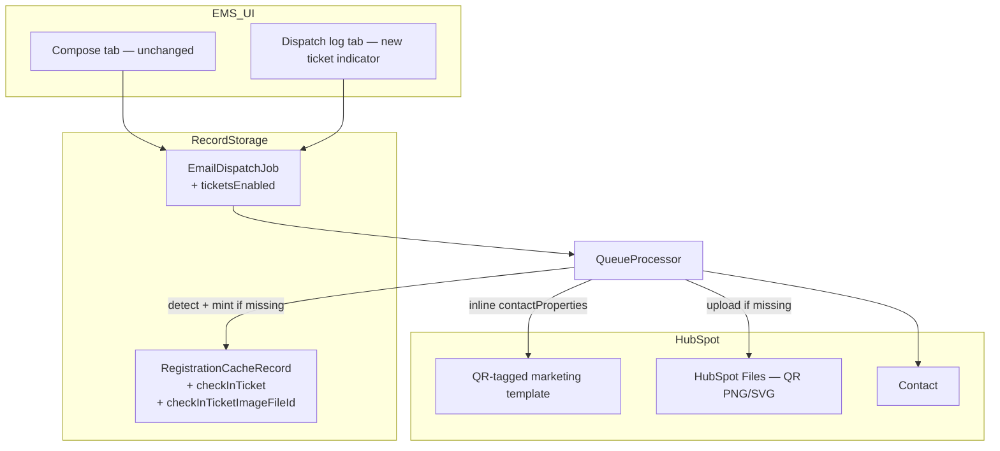

# Data Model: QR Ticket Emails

**Feature**: 008-qr-ticket-emails
**Date**: 2026-07-16
**Prerequisites**: [005-email-dispatch/data-model.md](../005-email-dispatch/data-model.md), [ADR-007](../../docs/decisions/007-hubspot-custom-objects-registration.md) §3, [ADR-010](../../docs/decisions/010-qr-ticket-email-single-send.md), [spec.md](./spec.md)

This feature **extends** two existing entities rather than introducing a new store — `EmailDispatchJob` (Slice 2) gains a flag, and `RegistrationCacheRecord` (Slice 1/ADR-007) gains the ticket fields it was already earmarked to hold.

---

## Extension: `EmailDispatchJob` (defined in [005-email-dispatch](../005-email-dispatch/data-model.md))

| Field | Type | Notes |
| :--- | :--- | :--- |
| `ticketsEnabled` | boolean | **New.** Computed once at job creation by checking whether the chosen template contains the QR placeholder (FR-001). Persisted so `QueueProcessor` never re-detects on retries, and so the Dispatch log can show the indicator immediately, before the job has even run (FR-006). |

No other `EmailDispatchJob` field changes. A `ticketsEnabled: false` job behaves identically to a Slice 2 job today (FR-005) — this is the only new branch point in the existing dispatch lifecycle.

---

## Extension: `RegistrationCacheRecord` (defined in `Backend/scripts/Utils/Platform/RegistrationCacheStore.ts`)

Per-registration operational cache, keyed by `contactId + eventId`, already purged wholesale on Event archive (`deleteAllForEvent`). ADR-007 §3 originally earmarked this store for "QR nonce"; this feature is the first thing to actually populate ticket data into it.

| Field | Type | Notes |
| :--- | :--- | :--- |
| `checkedInAt` | string \| null | Existing — unchanged. |
| `scanMethod` | `CheckInScanMethod` \| null | Existing — unchanged. |
| `qrNonce` | string \| null | Existing, currently unused by any writer — superseded by `checkInTicket` below; left in place for compatibility, not repurposed. |
| `checkInTicket` | string \| null | **New.** The signed check-in JWT (event+contact identity, RS256) for this Contact + Event pairing. Minted once ("mint if missing" — FR-002); never rotated by a later dispatch. |
| `checkInTicketImageFileId` | string \| null | **New.** The HubSpot Files id of the uploaded QR image encoding `checkInTicket`. Reused across repeat dispatches to the same recipient (re-uploaded only if missing), and deleted via the Files API when `deleteAllForEvent` purges the Event — closing the loop on ADR-010's "purge on Event archive" for the image host, not just the Record Storage row. |

**Mint-if-missing rule** (FR-002): before sending, look up the cache row for `(contactId, eventId)`. If `checkInTicket` is already set, reuse it and its `checkInTicketImageFileId` as-is. If not, mint a new ticket, upload its QR image, and write both fields into the row — merging with (not overwriting) any existing `checkedInAt`/`scanMethod` from a prior check-in.

**Ticket lifecycle**: identical to the existing cache row's lifecycle — invalid once the Event has passed (FR-010), deleted (Record Storage row **and** HubSpot Files upload) on Event archive via `deleteAllForEvent`.

---

## New value: signed ticket claims (no new storage — reuses the existing check-in JWT shape)

The ticket **is** a check-in JWT, using the exact claim shape `Utils/CheckInJwt.ts` already verifies on scan (`Backend/scripts/Utils/HubSpotSchema.ts`'s `CHECKIN_JWT_ALG`/`CHECKIN_JWT_ISSUER`):

| Claim | Type | Notes |
| :--- | :--- | :--- |
| `contactId` | string | HubSpot Contact id |
| `emsEventId` | string | HubSpot Event record id (per `BE-REDESIGN-005` / ADR-007 §Decision) |
| `iss` | string | `CHECKIN_JWT_ISSUER` |
| `iat` | number | Mint time |
| `exp` | number | Existing expiry policy — unchanged by this feature |

This feature adds the **signing** half (mint); verification already exists and is untouched.

---

## HubSpot read/write models (DTO only — no new Record Storage)

### QR template detection result (not persisted — computed per dispatch-create call)

| Field | Notes |
| :--- | :--- |
| `hasQrPlaceholder` | Fetched via `GET /marketing/v3/emails/{emailId}` content, checked for the fixed personalization token string. Feeds `EmailDispatchJob.ticketsEnabled` at creation; not re-checked at processing time. |

### QR image upload (DTO only)

| Field | Notes |
| :--- | :--- |
| `fileId` | HubSpot Files id — persisted on `RegistrationCacheRecord.checkInTicketImageFileId` |
| `url` | Public HubSpot Files URL — passed inline as `contactProperties`, never persisted on the Contact record (`FR-003`) |

---

## Audit events (extends 005's dispatch audit actions)

| Action | When | Metadata |
| :--- | :--- | :--- |
| `email.dispatch.create` | Existing (005) — now also includes `ticketsEnabled` in metadata | `dispatchId`, `recipientCountPlanned`, `scheduled`, `ticketsEnabled` |
| `checkin.ticket.mint` | **New.** First time a ticket is minted for a `(contactId, eventId)` pair | `eventId`, `contactId` — **no** email/name (matches existing PII-audit convention) |

No new audit action for reused tickets (mint-if-missing hits produce no write, so nothing to audit beyond the existing dispatch-level `email.dispatch.create`/`complete`).

---

## Out of scope (explicit)

| Item | Reason |
| :--- | :--- |
| A dedicated ticket/registration Record Storage entity | `RegistrationCacheRecord` already exists for exactly this purpose (ADR-007 §3) — no new store |
| Durable Contact-record properties for the QR URL | `FR-003` / ADR-010 Decision #4 — inline `contactProperties` only |
| A dedicated HubSpot subscription-type entity | Parked — see spec Assumptions |
