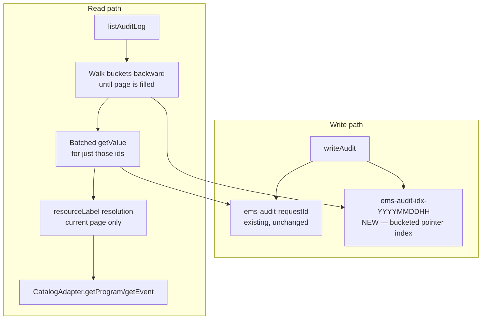

# Data Model: Audit Log Operator UX

**Feature**: 009-audit-log-ux
**Date**: 2026-07-17
**Prerequisites**: [ADR-013](../../docs/decisions/013-audit-index-scope.md), [research.md](./research.md), [spec.md](./spec.md)

This feature **extends** the existing audit entry storage with a new bucketed index, and extends the existing API entry shape with one field — it does not introduce a new domain entity.

---

## Extension: `AuditStore` write path (`Backend/scripts/Utils/Platform/AuditStore.ts`)

| Element | Type | Notes |
| :--- | :--- | :--- |
| `ems-audit-{requestId}` | existing key, unchanged | The audit entry itself — durable, independent of the index. Never deleted or modified by this feature. |
| `ems-audit-idx-{YYYYMMDDHH}` | **New** key, one per hour-bucket that has had at least one write | Value: JSON array of `requestId` strings for that hour, newest-first (prepended on each write). Shares the entry's 90-day TTL so index and entries expire together — no orphaned index keys outliving their entries, or vice versa (see research.md R-001). |

**Write rule**: `writeAudit(entry)` writes the entry as today, **and** reads the current hour's bucket (by `entry.timestamp`), prepends `entry.requestId`, and writes the bucket back with the same TTL. Accepted risk: two writes landing in the same bucket at the same moment can race (last `setValue()` wins) — documented in research.md R-001, does not lose the underlying audit entry.

---

## Extension: `listAuditLog` read path (`Backend/scripts/Utils/Audit.ts`)

| Parameter | Type | Notes |
| :--- | :--- | :--- |
| `eventId` | string, optional | Existing — unchanged, scopes to `resourceType: 'catalog_event'` + matching `resourceId`. |
| `page` / `pageSize` | number, optional | Existing — unchanged shape, now served from the bucket-walk instead of a full scan. |
| `action` | string, optional | **New.** Exact match against `AuditEntry.action`. |
| `actor` | string, optional | **New.** Exact match against `AuditEntry.actorEmail`. |
| `resourceType` | string, optional | **New.** Exact match against `AuditEntry.resourceType`. |
| `resourceId` | string, optional | **New.** Exact match against `AuditEntry.resourceId`. |

All four filters combine with **AND** semantics (spec Assumptions) and are applied as scan-and-discard against the entries fetched while walking buckets for the requested page — not a separate indexed lookup (ADR-013).

---

## Extension: `AuditLogApiEntry` (`Backend/scripts/Utils/Types.ts`, mirrored in `Frontend/src/types.ts` as `AuditLogEntry`)

| Field | Type | Notes |
| :--- | :--- | :--- |
| `id` / `timestamp` / `action` / `actor` / `eventId` / `resourceType` / `resourceId` / `outcome` / `metadata` | existing | Unchanged. |
| `resourceLabel` | `string \| null`, optional | **New.** Set only for `resourceType` of `catalog_program`/`catalog_event`, resolved against the live HubSpot catalog for the current page's distinct resourceIds only (FR-008). `null` when the referenced resource no longer exists (FR-007) — Frontend renders this as the fallback label, not a raw id. Absent (`undefined`) for other resource types (e.g. `session`), which continue to display as they do today. |

---

## Resource-label resolution (DTO only — no new storage)

| Step | Detail |
| :--- | :--- |
| 1. Collect | Distinct `(resourceType, resourceId)` pairs from the current page's entries where `resourceType` is `catalog_program` or `catalog_event`. |
| 2. Resolve | Call `CatalogAdapter.getProgram(id)` / `getEvent(id)` directly (not the throwing `resolveCatalogEvent*` guards) for each distinct pair. |
| 3. Fallback | A `null` adapter result (resource no longer exists) maps to `resourceLabel: null` on every entry sharing that resourceId — Frontend shows a readable "no longer available" label, never a raw id or an error. |

No caching of resolved labels across requests in this slice — each page's distinct ids are resolved fresh, bounded by page size (research.md R-002). A Record-Storage-backed name cache is explicitly out of scope here (see research.md R-002 alternatives).

---

## Frontend: `AuditLogEntry` filter state (view-local, not persisted)

| Field | Type | Notes |
| :--- | :--- | :--- |
| `actionFilter` / `actorFilter` / `resourceTypeFilter` / `resourceIdFilter` | string, optional, single-select | Held in `AuditView.tsx` component state; only sent to the backend when the operator clicks **Apply** (FR-004) — not live-as-you-type. |

---

## Out of scope (explicit)

| Item | Reason |
| :--- | :--- |
| Per-filter-dimension secondary index | ADR-013 — filters are scan-and-discard within the time-ordered index |
| Record-Storage-backed Program/Event name cache | research.md R-002 — unnecessary at this slice's bounded per-page HubSpot call volume |
| Multi-select per filter dimension | spec Assumptions — single-select, AND semantics, matches existing simple filter-panel conventions |
| Write-time `resourceLabel` snapshot (historical-accuracy after a rename) | Already tracked separately as `BE-SLICE007-002`'s Phase 2 "optional write-time label" — this slice is read-time-only |
| Date-range filtering | spec Assumptions — not one of the four committed filter dimensions |
