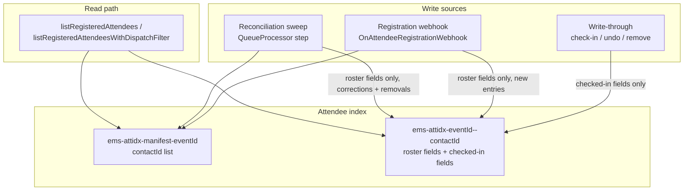

# Data Model: Attendee Index Performance Fix

**Feature**: 011-attendee-index-perf
**Date**: 2026-07-17
**Prerequisites**: [ADR-011](../../docs/decisions/011-attendee-index-freshness.md), [ADR-012](../../docs/decisions/012-attendee-index-write-conflict-resolution.md), [research.md](./research.md), [spec.md](./spec.md)

This feature introduces one new derived-cache entity (the Attendee index entry) plus its per-Event manifest — it does not change HubSpot's system-of-record shape, and does not change the `GET attendees` API response shape (`AttendeeSummary`/`ListAttendeesResult`, `Utils/HubSpot/CustomObjectAdapter.ts:14-37`).

---

## New: `AttendeeIndexStore` (`Backend/scripts/Utils/Platform/AttendeeIndexStore.ts`)

| Element | Type | Notes |
| :--- | :--- | :--- |
| `ems-attidx-manifest-{eventId}` | **New** key, one per Event that has at least one registered attendee | Value: JSON array of that Event's registered `contactId`s. Updated by the registration webhook (add) and the reconciliation sweep (add missed / remove orphaned) — write-through (check-in/undo) never adds/removes membership, only removal write-through does. |
| `ems-attidx-{eventId}--{contactId}` | **New** key, one per registered attendee per Event | Value: `AttendeeIndexEntry` (below). Shares TTL with the manifest — both derived from the same Event end-date-or-fallback calculation (research.md R-006), so index and manifest expire together. |

### `AttendeeIndexEntry` shape

| Field | Type | Owner (per ADR-012 field-scoped writes) | Notes |
| :--- | :--- | :--- | :--- |
| `contactId` | `string` | set once, immutable | HubSpot Contact id |
| `firstName` / `lastName` / `company` / `email` / `accountManager` / `attendeeType` | roster/display fields, types matching `AttendeeSummary` (`CustomObjectAdapter.ts:14-23`) | **Registration webhook** (on create) + **reconciliation sweep** (on correction) | Never written by check-in/undo/remove write-through |
| `rosterObservedAt` | `string` (ISO timestamp) | Registration webhook / reconciliation sweep | The observed-timestamp guard field for the roster/display group (ADR-012) — an incoming write to these fields is applied only if its `rosterObservedAt` is `>=` what's currently stored |
| `checkedIn` | `boolean` | **Write-through only** (check-in confirm / undo) | Never written by the webhook or the sweep |
| `checkedInAt` | `string \| null` | Write-through only | Mirrors `AttendeeSummary.checkedInAt` |
| `checkedInObservedAt` | `string` (ISO timestamp) | Write-through only | The observed-timestamp guard field for the checked-in-state group — an incoming write is applied only if its `checkedInObservedAt` is `>=` what's currently stored |

**Write rule**: every write to `AttendeeIndexStore` is a read-modify-write against the existing entry (or a fresh one, for a first-time registration): for each field group being written (roster/display vs. checked-in-state), apply the incoming fields only if the incoming group's own observed-at timestamp is `>=` the currently stored value for that group (or the group has no stored value yet). Never a blind whole-record overwrite (ADR-012).

**Accepted risk**: two writers touching the exact same entry at the exact same instant can still race at the read-modify-write level (research.md R-003) — same category of accepted risk as `AuditStore`'s hour-bucket write (009), narrowed here by per-attendee (not per-Event-wide) write granularity.

---

## Extension: `HubSpotCustomObjectAdapter.listRegisteredAttendees` read path

| Parameter | Type | Notes |
| :--- | :--- | :--- |
| `eventId` | `string` | Existing — unchanged. Now resolves the Event's manifest instead of a live HubSpot association fetch. |
| `checkedIn` | `boolean`, optional | Existing — unchanged filter semantics, now applied against index entries. |
| `query` | `string`, optional | Existing — unchanged free-text search semantics (name/company/email), now applied against index entries loaded for the Event (bounded by that Event's roster, not the whole workspace — research.md R-002). |
| `page` / `pageSize` | `number` | Existing — unchanged shape, now served from the index-backed in-memory slice instead of a live HubSpot page. |

`listRegisteredAttendeesWithDispatchFilter` (`Utils/DispatchAudience.ts`) applies its existing dispatch-sent/not-sent filter against the same index-backed result set instead of looping live HubSpot pages.

---

## No change: `AttendeeSummary` / `ListAttendeesResult` (`Utils/HubSpot/CustomObjectAdapter.ts:14-37`)

The `GET attendees` API response shape is byte-for-byte unchanged by this feature — the index is purely how the same `AttendeeSummary` rows are produced, not a change to what's returned.

---

## Manifest write ownership summary

| Writer | Adds to manifest | Removes from manifest | Writes entry fields |
| :--- | :---: | :---: | :--- |
| Write-through (check-in confirm) | — | — | `checkedIn`/`checkedInAt`/`checkedInObservedAt` only |
| Write-through (undo check-in) | — | — | `checkedIn`/`checkedInAt`/`checkedInObservedAt` only |
| Write-through (remove attendee) | — | ✅ (and deletes the entry) | — |
| Registration webhook | ✅ (new registration) | — | roster/display fields + `rosterObservedAt` |
| Reconciliation sweep | ✅ (missed registration found) | ✅ (orphaned — contact no longer associated) | roster/display fields + `rosterObservedAt`, on correction only |

---

## Out of scope (explicit)

| Item | Reason |
| :--- | :--- |
| Per-field secondary index for search (e.g. a name-prefix index) | Not needed — search is applied in-memory against one Event's bounded roster (research.md R-002), not a workspace-wide scan |
| Changing HubSpot's role as system of record | The Attendee index is a derived, rebuildable cache — spec FR-012, ADR-011 |
| A new "resume cursor" for the reconciliation sweep | `triggerScript` self-rechaining already makes an interrupted sweep a cheap no-op/resume, same as `Utils/EventTicketPurge.ts` (research.md R-005) |
| Multi-writer true-simultaneous-collision elimination beyond the observed-timestamp guard | ADR-012 accepts this narrow residual risk explicitly — not re-opened here (research.md R-003) |
